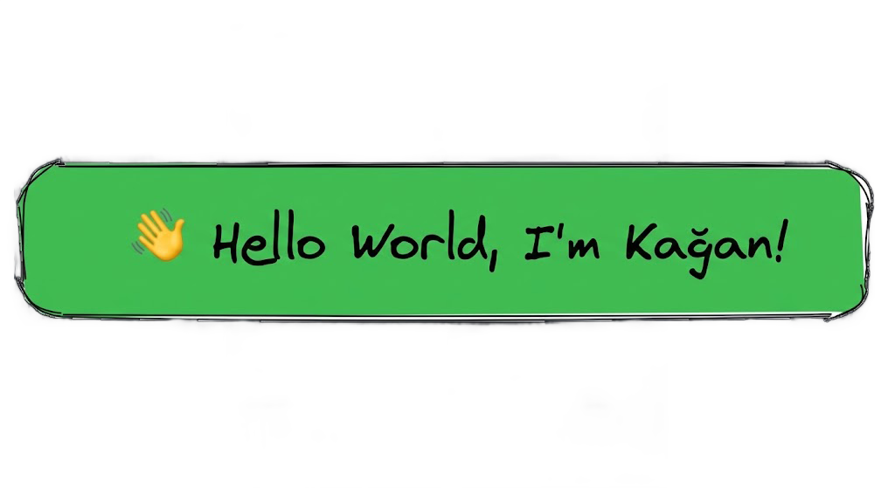

# Kağan Arıbaş
AI / NLP Engineer • CS undergrad @ Firat University • Turkish morphology & tokenization • Production RAG and retrieval optimization

## Portfolio
Visit my portfolio for demos, case studies, and deeper project details: https://your-portfolio.example
Best viewed on desktop.

I build practical NLP systems with a focus on Turkish language modeling, efficient retrieval, and LLM app quality. Recently I am working on FST-based morphology, RAG pipelines, and evaluation-driven improvements.

## Focus
- RAG systems: retrieval, chunking, re-ranking, and evaluation loops
- Turkish NLP: morphology, tokenizers, and linguistic pipelines
- LLM applications: chatbot integration, cost/latency optimization, and tooling

## Highlights
- Reduced token usage and API cost by ~80–90% with system-level optimizations while preserving quality
- Built an FST-based Turkish morphology model with 65K+ stems and 200+ suffix forms
- Designed a Viterbi-based POS disambiguation approach for context-sensitive analyses

## Projects
- Turkish Morphological Segmentation (OpenFST) — https://github.com/TurkishTokenizer/turkish-morphological-segmentation
- FitTurkAI (Teknofest) — https://github.com/FitTurkAI/FitTurkAI
- IpekGPT (production LLM chatbot) — https://ipekgpt-production.up.railway.app

## Tech
- Languages: Python, C#, C++, Java
- ML/NLP: PyTorch, scikit-learn, Transformers, embeddings, RAG
- Data: Pandas, NumPy, Matplotlib
- Infra: Docker, Linux, Git

## Collaboration
- Problem solving: structured approach, clear trade-offs, and measurable outcomes
- Teamwork: dependable in cross-functional teams, open to feedback, and supportive in reviews

## Links
- Portfolio: https://your-portfolio.example
- GitHub: https://github.com/Kagankakao
- LinkedIn: https://linkedin.com/in/aribaskagan
- X: https://x.com/aribaskagan
- YouTube: https://youtube.com/@kegan_dev
- Email: aribaskagan@gmail.com

## Stats

